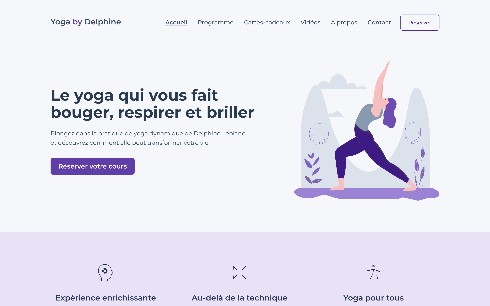

[](https://app.netlify.com/sites/yoga-by-delphine/deploys)

# Yoga by Delphine website

This is the website for [yogabydelphine.com](http://www.yogabydelphine.com/).

You can book online and in-studio yoga courses (only available in french).



This site is based on a JAMSTACK architecture:

- [GatsbyJS](https://www.gatsbyjs.com/): a static site generator
- [Shopify](https://www.shopify.com/) for the e-commerce part
- [Netlify](https://www.netlify.com/) for CI/CD/hosting
- [Cloudinary](https://cloudinary.com/) to manage images
- [Tailwindcss](https://tailwindcss.com/)

## How does it work?

Performance and accessibility are essential for this project. That's the reason why I rely on a static site generator such as Gatsby. The challenge is to manage dynamic data (courses).

The key idea of this architecture is the use of webhooks. I define webhooks to trigger builds on Netlify when a course is created/updated/deleted on Shopify.

## Design

You can find the website design in Figma [here](https://www.figma.com/file/wioiqeZX8Z0hOK0UsHxMAG/YogaByDelphine?node-id=4%3A10)

## Development

> **NOTE:** a Cloudinary account and a Shopify partner account are required.

- Clone the repo:

```bash
$ git clone https://github.com/nicolaserny/yoga-by-delphine.git
```

- Go to the project directory and install dependencies:

```bash
$ cd yoga-by-delphine && npm install
```

- Configure env variables by creating a _.env.development_ file (use the template file)

- Run the development server:

```bash
$ npm run develop
```

## License

[MIT License](https://raw.githubusercontent.com/nicolaserny/yoga-by-delphine/master/LICENSE)
